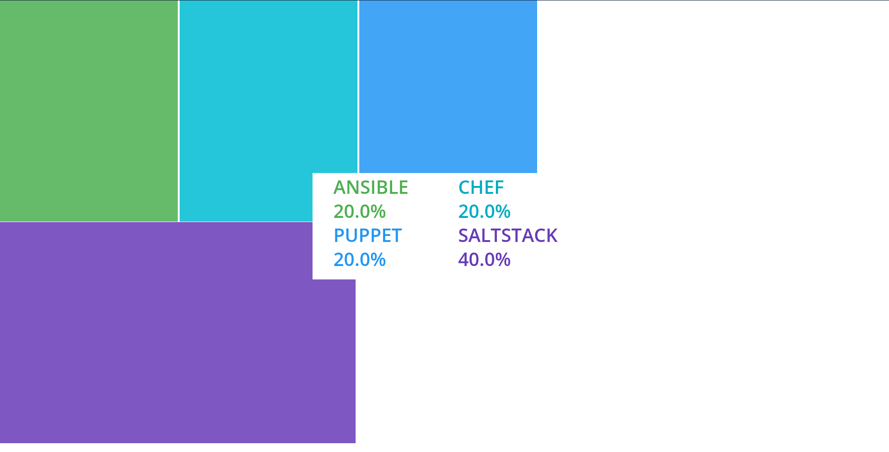
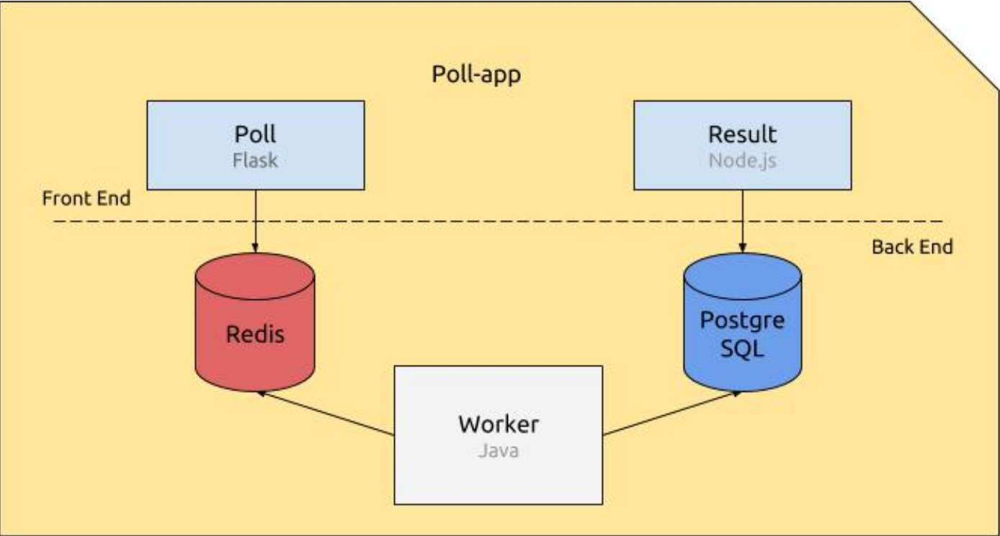

# Popeye



## A simple app (like strawpoll.com) to learn how to use Docker containers

There are five elements constituting the application, connected in a container :
  * Poll, a Flask Python web application that gathers votes and push them into a Redis queue
  * A Redis queue, which holds the votes sent by the Poll application, awaiting for them to be consumed by
the Worker.
  * The Worker, a Java application which consumes the votes being in the Redis queue, and stores them into
a PostgreSQL database.
  * A PostgreSQL database, which (persistently) stores the votes stored by the Worker.
  * Result, a Node.js web application that fetches the votes from the database and displays the. . . well, result. ;)


## Usage

Check that Docker is installed on your computer and started.
``` zsh
docker-compose up
```
Then go to [localhost:5001](localhose:5001) and [localhost:8080](localhost:8080).

With this project I learned how to use Docker images and Docker compose.
___
Check my [portfolio](http://simonlefourn.com) for more informations on this project.

